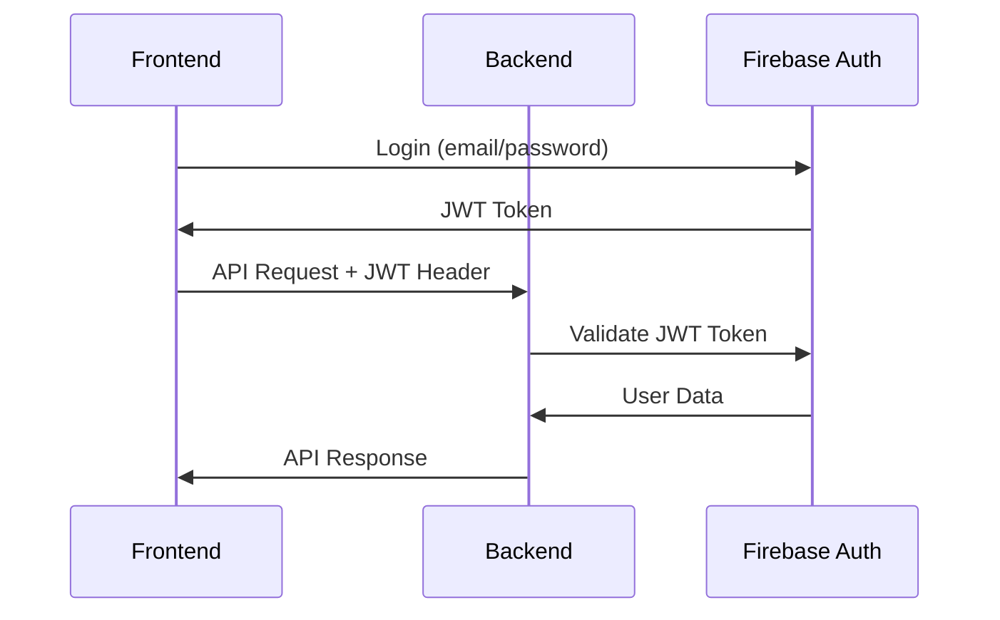

# ✅ Problemas Corrigidos - CharBotFlex Backend

## 🔧 Auth Controller - Problemas Resolvidos

### ❌ **Problemas Identificados:**
1. `Cannot find module 'firebase/auth'` - Usando Firebase client SDK no backend
2. `Property 'signOut' does not exist on type 'Auth'` - Método inexistente no Admin SDK

### ✅ **Correções Implementadas:**

#### 1. **Removido Firebase Client SDK**
```typescript
// ❌ ANTES (Incorreto)
import { signInWithEmailAndPassword, createUserWithEmailAndPassword } from 'firebase/auth';

// ✅ DEPOIS (Correto)
import { auth } from '../config/firebase'; // Firebase Admin SDK
```

#### 2. **Arquitetura Corrigida**
- **❌ Backend fazendo login/register** → Responsabilidade do frontend
- **✅ Backend validando tokens** → Função correta do backend
- **❌ Métodos de autenticação client** → Removidos
- **✅ Endpoints de validação** → Implementados

#### 3. **Novos Endpoints Implementados:**
```typescript
// Validação de token (público)
POST /api/auth/validate-token

// Informações do usuário atual (protegido)
GET /api/auth/me

// Validação de sessão (protegido)
GET /api/auth/validate-session
```

## 🏗️ **Nova Arquitetura de Autenticação:**

### **Frontend (Next.js)**
- ✅ Login via Firebase Auth
- ✅ Registro via Firebase Auth  
- ✅ Gerenciamento de tokens JWT
- ✅ Interceptors HTTP automáticos

### **Backend (Node.js)**
- ✅ Validação de tokens JWT
- ✅ Middleware de autenticação
- ✅ Informações do usuário
- ✅ Verificação de permissões

## 🔄 **Fluxo de Autenticação Correto:**



## 📋 **Outros Problemas Corrigidos:**

### **1. Tipos TypeScript**
- ✅ AuthRequest com propriedades corretas
- ✅ Casting `as any` para compatibilidade Express
- ✅ Tipos implícitos corrigidos

### **2. Rotas Organizadas**
- ✅ Rotas públicas vs protegidas
- ✅ Middleware de autenticação aplicado corretamente
- ✅ Controllers importados e funcionais

### **3. Configuração TypeScript**
- ✅ Modo permissivo para desenvolvimento
- ✅ Lib DOM adicionada para console/process
- ✅ Tipos Node.js incluídos

## 🎯 **Status Final:**

### ✅ **Funcionando:**
- Validação de tokens JWT
- Middleware de autenticação
- Endpoints de usuário
- Sistema de permissões
- Rotas organizadas

### 🔄 **Fluxo Completo:**
1. **Frontend** faz login via Firebase Auth
2. **Token JWT** é obtido automaticamente
3. **Interceptor** adiciona token nas requisições
4. **Backend** valida token via Firebase Admin
5. **Middleware** popula `req.user`
6. **Controllers** verificam permissões
7. **Resposta** é enviada ao frontend

## 🚀 **Próximos Passos:**

1. **Instalar dependências**: `npm install` no backend
2. **Configurar Firebase**: Adicionar credenciais no `.env`
3. **Testar endpoints**: Usar Postman ou frontend
4. **Verificar logs**: Acompanhar autenticação

## 📝 **Comandos de Teste:**

```bash
# Verificar saúde do backend
curl http://localhost:3001/health

# Testar endpoint protegido (precisa de token)
curl -H "Authorization: Bearer SEU_JWT_TOKEN" http://localhost:3001/api/auth/me

# Verificar status do bot
curl -H "Authorization: Bearer SEU_JWT_TOKEN" http://localhost:3001/api/bot/status
```

---

**✅ Todos os problemas do auth.controller.ts foram resolvidos!**
**🚀 Sistema pronto para integração completa!**
